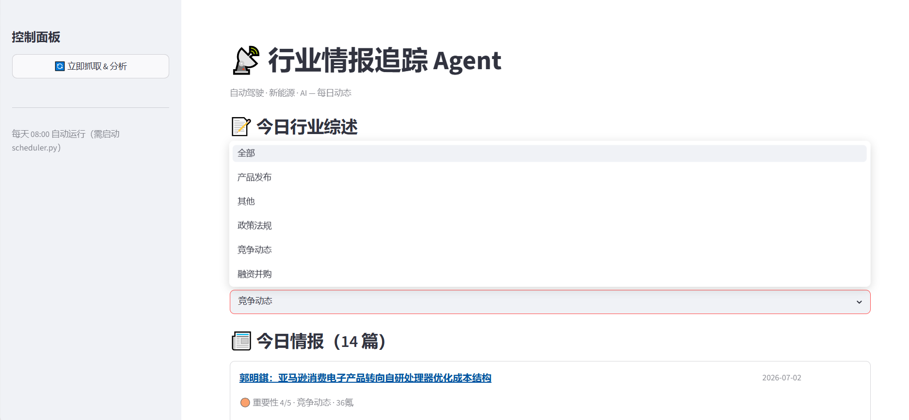
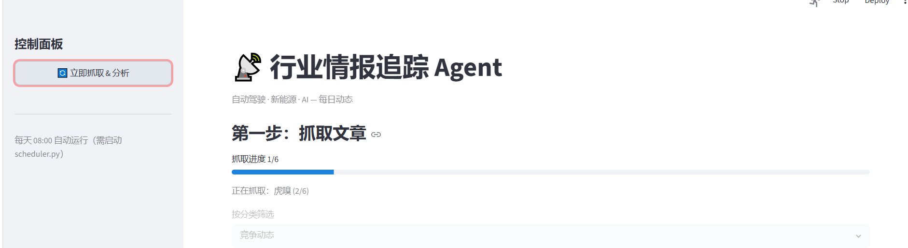

# 行业情报追踪 Agent

自动抓取自动驾驶、新能源、AI 领域的每日新闻，由 Claude 完成分类、评分与摘要，生成结构化情报简报。


---

## 界面预览

**每日行业综述**


**文章列表（按重要性排序）**


**分类筛选**


**实时抓取进度条**


---

## 功能特性

- **多源抓取**：同时订阅 6 个中英文媒体 RSS（36氪、虎嗅、钛媒体、TechCrunch、The Verge、Electrek）
- **智能过滤**：只保留当天发布、命中关键词的文章
- **AI 分析**：调用 Claude API 对每篇文章自动完成：
  - 分类（政策法规 / 技术突破 / 融资并购 / 产品发布 / 竞争动态）
  - 重要性评分（1-5 分），低于 3 分自动过滤
  - 一句话摘要
- **每日综述**：AI 生成 150 字行业趋势总结
- **可视化界面**：Streamlit 网页，支持按分类筛选，实时进度条
- **定时任务**：每天 08:00 自动运行（可选）

---

## 技术栈

| 模块 | 技术 |
|------|------|
| 数据采集 | `feedparser` + `BeautifulSoup` |
| 数据存储 | `SQLite` |
| AI 分析 | Claude API（claude-sonnet） |
| 定时任务 | `APScheduler` |
| 前端界面 | `Streamlit` |

---

## 快速启动

### 1. 克隆项目

```bash
git clone https://github.com/your-username/intelligence-agent.git
cd intelligence-agent
```

### 2. 安装依赖

```bash
pip install -r requirements.txt
```

### 3. 配置 API Key

在项目根目录创建 `.env` 文件：

```
ANTHROPIC_API_KEY=your_api_key_here
```

### 4. 启动

```bash
python -m streamlit run app.py
```

或者 Windows 用户直接双击 `启动.bat`

浏览器打开 `http://localhost:8501`，点击「立即抓取 & 分析」即可。

---

## 项目结构

```
intelligence-agent/
├── app.py              # Streamlit 主界面
├── fetcher.py          # RSS 抓取 + 日期/关键词过滤
├── processor.py        # 去重 + SQLite 存储
├── analyzer.py         # Claude 分析（分类/评分/摘要）
├── scheduler.py        # 定时任务
├── config.py           # 配置（RSS 源、关键词、模型）
├── requirements.txt    # 依赖列表
└── 启动.bat            # Windows 一键启动
```

---

## 自定义配置

在 `config.py` 中可以修改：

- `RSS_FEEDS`：增减订阅的媒体源
- `KEYWORDS`：调整关键词过滤列表
- `FETCH_HOUR`：修改定时任务触发时间

---

## 评分标准

| 分数 | 含义 |
|------|------|
| 5 | 重大政策、头部公司技术突破、亿级融资 |
| 4 | 知名公司动态、重要行业报告、中等融资 |
| 3 | 一般公司动态、常规产品迭代 |
| 1-2 | 低质内容，自动过滤不展示 |
