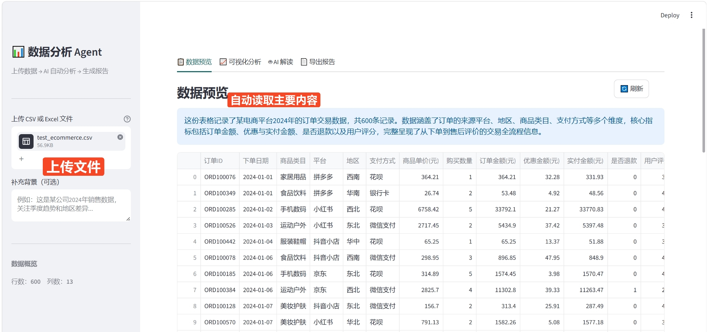
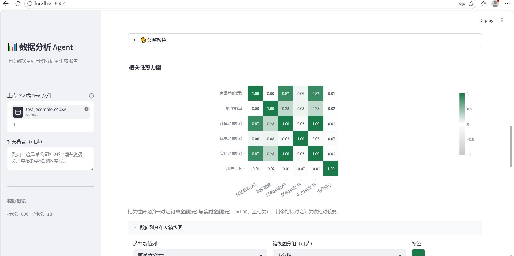
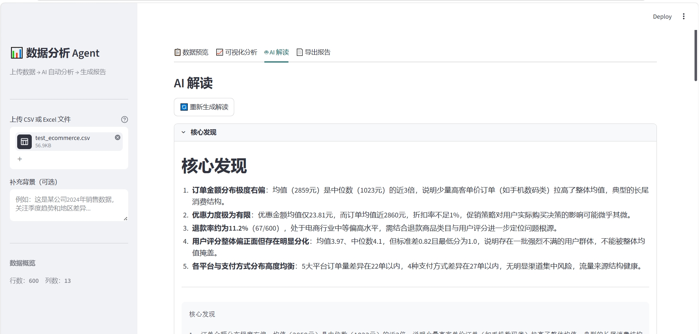
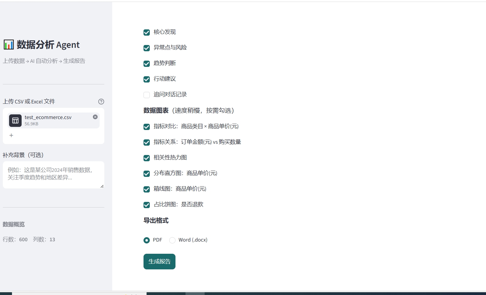

# 数据分析 Agent

不会写代码也能做数据分析——上传一份 CSV 或 Excel，AI 自动读懂数据内容、生成可视化图表、提炼核心洞察，最终一键导出完整的 PDF 或 Word 分析报告。

### 能做什么

**自动理解数据**：上传文件后，系统自动识别数值列、类别列、日期列，AI 用 2~3 句话概括这份数据是什么、记录了哪些维度——不需要你先解释数据背景。

**多维可视化**：内置 6 种图表类型，支持按类别列过滤数据，所有图表联动响应筛选结果：
- 指标对比柱状图（分类维度 × 数值聚合）
- 指标关系散点图（自选 X/Y 轴，按分类着色）
- 时序趋势折线图（支持日 / 周 / 月粒度切换）
- 相关性热力图（直观看出哪些指标互相影响）
- 数值分布直方图 + 箱线图
- 类别占比饼图

每张图表均可单独调色，也支持一键切换全局配色主题。

**AI 深度解读**：Claude 对数据生成结构化分析报告，分为四个板块：核心发现、异常点（标注风险等级）、趋势判断、行动建议。每个板块支持一键复制纯文本。支持多轮追问，针对具体问题继续深挖。

**灵活导出报告**：可自由勾选导出哪些内容（统计摘要 / AI 解读各板块 / 追问记录 / 图表），导出为 PDF（完整 Markdown 渲染）或 Word（可二次编辑）。

## 界面截图

**数据预览**


**可视化分析**


**AI 解读**


**导出报告**


📄 [查看导出报告示例（PDF）](./screenshots/test_ecommerce.csv_report.pdf)

## 功能介绍

- **Tab1 数据预览**：AI 自动概括数据内容，展示基础统计（数值列 / 类别列 / 日期列分开呈现），缺失值报告
- **Tab2 可视化分析**：数据筛选面板联动所有图表；支持指标对比柱状图、散点图、时序趋势折线图、相关性热力图、分布直方图、类别占比饼图；统一配色 + 每图单独调色
- **Tab3 AI 解读**：Claude 生成核心发现、异常点（含风险等级）、趋势判断、行动建议；支持多轮追问
- **Tab4 导出报告**：细粒度勾选导出内容（统计摘要 / AI 解读各板块 / 追问记录 / 图表），支持 PDF 和 Word 两种格式

## 技术栈

- Python · Streamlit · Plotly · Claude AI (claude-sonnet-4.6)
- fpdf2（PDF 导出）· python-docx（Word 导出）· pandas · kaleido（图表截图）

## 测试数据

- `test_sales.csv`：新能源汽车销售数据（500 行）
- `test_ecommerce.csv`：电商订单数据（600 行）

## 本地启动

```bash
cd 数据分析Agent
pip install -r requirements.txt
python -m streamlit run app.py --server.port 8502
```

或直接双击 `启动.bat`

> 需在 `.env` 中配置 `ANTHROPIC_API_KEY`
